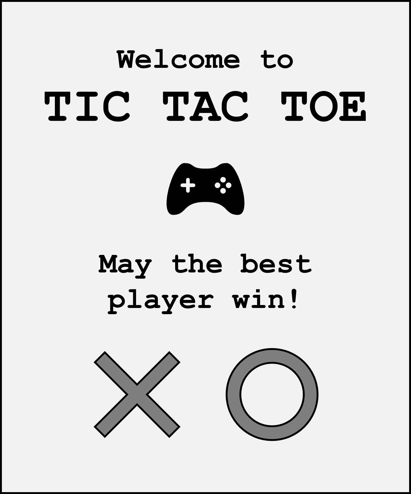

Just some fun projects, I've been working on in the past

Images for Tic Tac Toe with pygame GUI can be downloaded here (just adapt the path in the code to where you store the images):

      

Next, I want to add a version with human player vs. computer (hard-coded and possibly RL-based)
